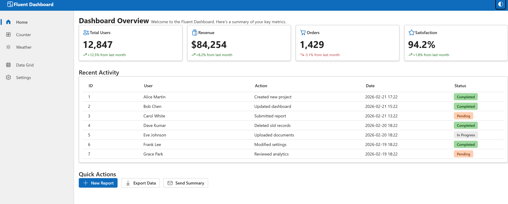

# Fluent Dashboard

A Blazor WebAssembly dashboard application built with [Fluent UI Blazor v5](https://github.com/microsoft/fluentui-blazor/tree/dev-v5).

## Live Demo

👉 **[netonia.github.io/FluentUI](https://netonia.github.io/FluentUI/)**

## Features

- **Dashboard** — Overview cards with key metrics, recent activity data grid, and quick actions
- **Counter** — Interactive counter with milestone dialog alerts
- **Weather** — Sortable weather forecast data grid with loading spinner
- **Data Grid** — Full-featured grid with search, sorting, and pagination
- **Settings** — Form controls showcase (text inputs, switch, slider, select)
- **Dark / Light Theme** — Toggle button in the header bar
- **Responsive Layout** — `FluentLayout` with collapsible sidebar navigation

## Tech Stack

| Layer | Technology |
|---|---|
| Framework | .NET 10 / Blazor WebAssembly |
| UI Components | [Microsoft.FluentUI.AspNetCore.Components](https://www.nuget.org/packages/Microsoft.FluentUI.AspNetCore.Components) **v5.0.0-rc.1** |
